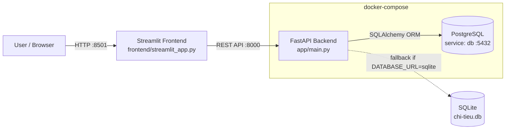

# Chi Tieu App — Personal Expense Tracker

> A full-stack personal finance application: log daily spending, auto-categorize it, visualize monthly breakdowns, and forecast month-end totals — all through a clean Streamlit UI backed by a FastAPI service and PostgreSQL.

---

## 📌 Project Purpose

**Chi Tieu App** helps individuals track where their money goes. It solves the common problem of *"I don't know how much I'll spend by the end of the month"* by combining:

- **Easy data entry** — add transactions with a note; the system auto-categorizes them (e.g. "ăn trưa" → *Food*).
- **Visual insights** — monthly pie charts show spending distribution by category.
- **Forecasting** — three statistical models (Linear Regression, Seasonal weekday/weekend split, and ARIMA) project the total month-end spend and compare it against a user-defined budget.

The goal is a lightweight, self-hostable expense tracker that demonstrates a real-world FastAPI + Streamlit + PostgreSQL stack, suitable for learning and portfolio use.

---

## 🏗️ System Architecture

The application is split into three layers. The **Streamlit frontend** talks to the **FastAPI backend** over REST; the backend persists data through **SQLAlchemy** into **PostgreSQL** (running as a separate container). A SQLite database is still supported for lightweight local development via the `DATABASE_URL` environment variable.



### Component overview

| Layer | Technology | Responsibility |
|-------|-----------|----------------|
| **Frontend** | Streamlit (`frontend/streamlit_app.py`) | Forms for entry, tables, charts, forecast UI |
| **API** | FastAPI + SQLAlchemy | CRUD, filtering, reporting, forecasting |
| **Database** | PostgreSQL 15 (Docker) / SQLite (local) | Persistent storage of transactions & categories |
| **Forecasting** | scikit-learn, statsmodels | Linear / Seasonal / ARIMA projections |
| **Charts** | Matplotlib | Monthly spending pie charts |

### Request flow

1. User interacts with the Streamlit UI (port **8501**).
2. Streamlit issues `requests` calls to the FastAPI service (port **8000**).
3. FastAPI validates input, queries/manipulates data via SQLAlchemy, and returns JSON or a PNG image stream.
4. PostgreSQL stores the data; `pg_isready` health checks ensure the API only starts once the DB is ready (`depends_on: condition: service_healthy`).

---

## 🚀 Getting Started

### Prerequisites

- **Docker Desktop** (Docker Engine + Compose v2)
- **Python 3.10+** (only needed if you run the Streamlit frontend locally instead of in Docker)
- `git`

### 1. Clone and enter the project

```powershell
git clone https://github.com/tungf2006/chi-tieu-app.git
cd chi-tieu-app
```

### 2. Start the backend with Docker Compose

```powershell
docker compose up -d --build
```

This builds the `api` image and starts two services:

- `chi-tieu-api` — FastAPI on `http://localhost:8000`
- `chi-tieu-db` — PostgreSQL 15 on `localhost:5432` (database `chitieu_db`)

> The API waits for the database to be healthy before accepting connections.

### 3. (Optional) Run the Streamlit frontend

The frontend is a standard Python app. Create a virtual environment and install dependencies:

```powershell
python -m venv venv
venv\Scripts\activate
pip install -r requirements.txt
```

Then launch it (it connects to `http://localhost:8000` by default):

```powershell
streamlit run frontend/streamlit_app.py
# or, to be explicit inside the venv:
# .\venv\Scripts\python.exe -m streamlit run frontend/streamlit_app.py
```

The UI opens at **http://localhost:8501**. To point it at a different API host, set the env var first:

```powershell
$env:API_BASE = "http://localhost:8000"
```

### 4. Verify

- **API docs (Swagger):** http://localhost:8000/docs
- **Interactive UI:** http://localhost:8501
- **Health:** `curl http://localhost:8000/` → `{"message":"Hello World"}`

### Local development without Docker

You can also run everything natively (SQLite by default):

```powershell
venv\Scripts\activate
pip install -r requirements.txt
uvicorn main:app --reload          # API on :8000
streamlit run frontend/streamlit_app.py   # UI on :8501
```

> ⚠️ **Security note:** the PostgreSQL password is no longer hardcoded — `docker-compose.yml` reads it from the environment with a safe default (`123456`). For any real deployment, copy `.env.example` to `.env` (gitignored) and set a strong password — never commit the real `.env`.

---

## 📚 API Documentation

Base URL: `http://localhost:8000`

Interactive documentation is auto-generated and available at `/docs` (Swagger UI) and `/redoc`.

### Transactions (`/transactions`)

| Method | Endpoint | Function |
|--------|----------|----------|
| `POST` | `/transactions` | Create a transaction. Auto-categorizes from `note` if `category_id` is omitted. |
| `GET` | `/transactions` | List all transactions. |
| `GET` | `/transactions/filter?category_id=&month=&year=` | Filter by category, month, and/or year. |
| `GET` | `/transactions/{id}` | Retrieve a single transaction. |
| `PUT` | `/transactions/{id}` | Partially update a transaction. |
| `DELETE` | `/transactions/{id}` | Delete a single transaction. |
| `DELETE` | `/transactions/clear` | Delete **all** transactions (used to reset data between tests). |
| `DELETE` | `/transactions?month=&year=` | Delete transactions for a given month/year. |

**Create example**
```bash
curl -X POST http://localhost:8000/transactions \
  -H "Content-Type: application/json" \
  -d '{"amount": 50000, "note": "ăn trưa", "date": "2026-08-21"}'
```

### Categories (`/categories`)

| Method | Endpoint | Function |
|--------|----------|----------|
| `POST` | `/categories` | Create a category. |
| `GET` | `/categories` | List all categories. |

### Reports (`/reports`)

| Method | Endpoint | Function |
|--------|----------|----------|
| `GET` | `/reports/monthly?month=&year=` | Monthly spending summary grouped by category (JSON). |
| `GET` | `/reports/monthly/chart?month=&year=` | Pie-chart image (PNG) of monthly spending. |

### Forecast (`/forecast`)

| Method | Endpoint | Function |
|--------|----------|----------|
| `GET` | `/forecast?month=&year=&method=&budget=` | Forecast month-end total spend. |

Query parameters:

- `month` *(int, required)* — target month (1–12)
- `year` *(int, required)* — target year
- `method` *(str)* — one of:
  - `linear` — Linear Regression on cumulative spend (baseline / burn rate)
  - `seasonal` — weekday/weekend split (captures weekly seasonality)
  - `arima` — ARIMA on daily amounts (captures trend; falls back to linear on <5 points)
- `budget` *(float, optional)* — your spending limit; when provided the response includes `delta`, `status` (`over`/`under`), and `percent_used`.

**Forecast example**
```bash
curl "http://localhost:8000/forecast?month=8&year=2026&method=arima&budget=5000000"
```

---

## 🖼️ Visuals

> Screenshots below are placeholders. Capture the running app and save images under `docs/screenshots/`, then update the paths.

### Streamlit UI

| View | Screenshot |
|------|------------|
| Transaction entry form |  |
| Transaction list & total |  |
| Charts & forecasting page |  |

### Data Visualizations

| Chart | Screenshot |
|-------|------------|
| Monthly spending pie chart (`/reports/monthly/chart`) |  |
| Forecast summary with budget comparison |  |

---

## 🧪 Tech Stack

- **Backend:** FastAPI, SQLAlchemy, Pydantic
- **Database:** PostgreSQL 15 (Docker) / SQLite (local dev)
- **Forecasting:** scikit-learn (Linear Regression), statsmodels (ARIMA)
- **Visualization:** Matplotlib (pie charts)
- **Frontend:** Streamlit
- **Containerization:** Docker, Docker Compose

## 📁 Project Structure

```
chi-tieu-app/
├── app/
│   ├── main.py                 # App factory & entry point
│   ├── core/database.py        # Engine, session, Base (env-driven DATABASE_URL)
│   ├── models/                 # Transaction, Category ORM models
│   ├── schemas/                # Pydantic request/response schemas
│   ├── services/
│   │   ├── categorize.py       # Auto-categorize from note
│   │   ├── reports.py          # Monthly summary & pie chart
│   │   └── forecast.py         # linear / seasonal / arima
│   └── api/routes/
│       ├── transactions.py
│       ├── categories.py
│       ├── reports.py
│       └── forecast.py
├── frontend/
│   └── streamlit_app.py        # Streamlit UI (entry at :8501)
├── alembic/                    # Database migrations
├── tests/                      # Unit & scenario tests
├── docker-compose.yml          # api + db (PostgreSQL) services
├── Dockerfile
└── requirements.txt
```

## 🔑 Key Concepts

- **Foreign Key:** `Transaction.category_id` → `Category.id` (one-to-many).
- **Migrations:** Alembic manages schema (instead of `create_all()`).
- **GroupBy:** Pandas `df.groupby("category")["amount"].sum()` aggregates spend per category.
- **StreamingResponse:** Returns a binary PNG stream for charts instead of JSON.
- **Forecasting:** time-series extrapolation with cumulative sums (linear), weekly seasonality, and ARIMA differencing.

### Forecast benchmark (8 datasets, 3 methods)

| Dataset | Linear | Seasonal | ARIMA |
|---------|--------|----------|-------|
| TC1 PerfectLinear | 0.0% | 0.0% | 0.0% |
| TC2 WeeklySeasonality | 1.9% | **0.0%** | 14.4% |
| TC3 IncreasingTrend | 15.9% | 13.7% | **0.1%** |
| TC5 DecreasingTrend | 25.5% | 22.0% | **0.3%** |
| TC4 Outlier | 24.1% | 25.5% | 156.7%* |

\* ARIMA is sensitive to outliers / sparse data — clean with IQR before fitting.
See `docs/SOP_DAY30_Compare_Tune.md` and `tests/test_forecast_scenarios.py`.

## ✅ Tests

```powershell
venv\Scripts\activate
python -m pytest tests/ -q
```

## 📄 License

MIT — free for personal and educational use.
